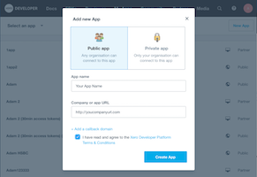
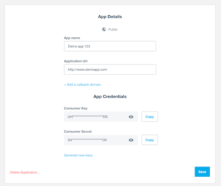
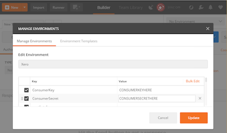
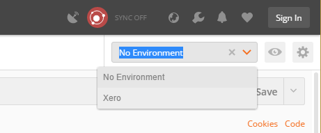
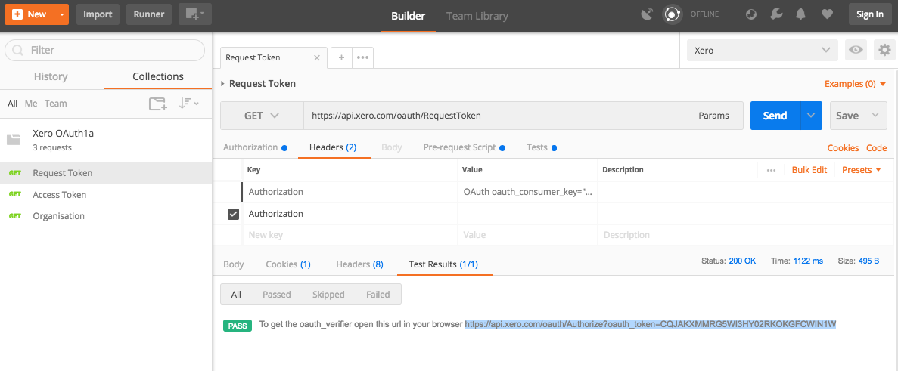
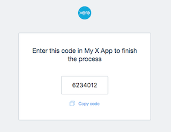

# Xero-Postman
A Postman collection for authenticating to the Xero API. 

## Steps to get up and running
Follow these steps to quickly get up and running with the Xero API and Postman:

### 1. Import the Xero OAuth1a collection and Xero postman environment into Postman
Click the button below to import the [collection](https://raw.githubusercontent.com/XeroAPI/Xero-Postman/master/Xero%20OAuth1a.postman_collection.json) and [environment](https://raw.githubusercontent.com/XeroAPI/Xero-Postman/master/Xero.postman_environment.json) into Postman.

[](https://app.getpostman.com/run-collection/89e9403256e30d1c61be#?env%5BXero%5D=W3siZW5hYmxlZCI6dHJ1ZSwia2V5IjoiQ29uc3VtZXJLZXkiLCJ2YWx1ZSI6IiIsInR5cGUiOiJ0ZXh0In0seyJlbmFibGVkIjp0cnVlLCJrZXkiOiJDb25zdW1lclNlY3JldCIsInZhbHVlIjoiIiwidHlwZSI6InRleHQifSx7ImVuYWJsZWQiOnRydWUsImtleSI6Im9hdXRoX3Rva2VuIiwidmFsdWUiOiIiLCJ0eXBlIjoidGV4dCJ9LHsiZW5hYmxlZCI6dHJ1ZSwia2V5Ijoib2F1dGhfdG9rZW5fc2VjcmV0IiwidmFsdWUiOiIiLCJ0eXBlIjoidGV4dCJ9LHsiZW5hYmxlZCI6dHJ1ZSwia2V5IjoiVGltZXN0YW1wIiwidmFsdWUiOiIiLCJ0eXBlIjoidGV4dCJ9LHsiZW5hYmxlZCI6dHJ1ZSwia2V5IjoiTm9uY2UiLCJ2YWx1ZSI6IiIsInR5cGUiOiJ0ZXh0In1d)

### 2. Create a public app at https://developer.xero.com/myapps
Go to the Xero developer portal and create a public app.

*Note* Postman doesn't support the RSA SHA1 signing method so you can't use the partner or private app types.

If you haven't already signed up for a xero account you can do so [here](https://www.xero.com/signup/api/).

### 3. Add your consumer key and consumer secret to the Xero environment variables in Postman
Copy the consumer key and consumer secret of your app into the ConsumerKey and ConsumerSecret environment varaibles in Postman.

### 4. Select the Xero environment
Select Xero from the environment drop-down menu in Postman

### 5. Get your request token
Hit Send on the GET Request Token call in Postman. 

In the response section go to the Test Results tab and copy the authorization url.

### 6. Get your oauth verifier
Paste the authorization url into your browser, login to xero, select the org to connect to and copy the oauth verifier to your clipboard.

### 7. Get your access token
Paste the oauth verifier at the end of the GET Access Token URL in Postman. Hit Send on the request. 

Congrats! You're now authenticated and can start making API calls. Your access token will last for 30mins, after which time you'll need to report steps 4-6 to get a new token.

### 8. Make your first API call!
Click Send on the GET Organisation request to make your first API call.

### 9. Import our OpenAPI definition
Now that you're authenticated, import the [official Xero OpenAPI](https://github.com/XeroAPI/Xero-OpenAPI) (Swagger) description and import all the endpoints for the Accounting API. 
